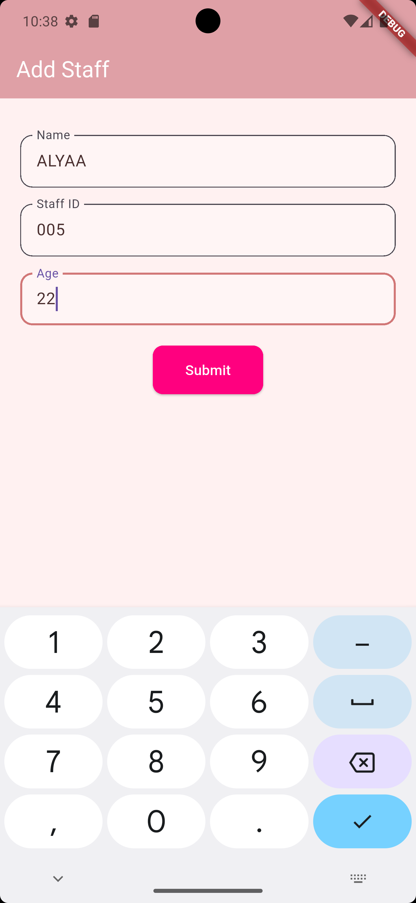
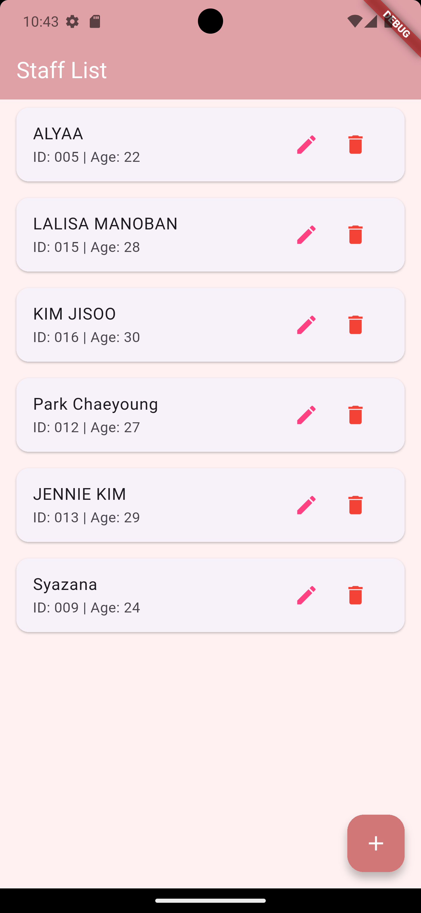
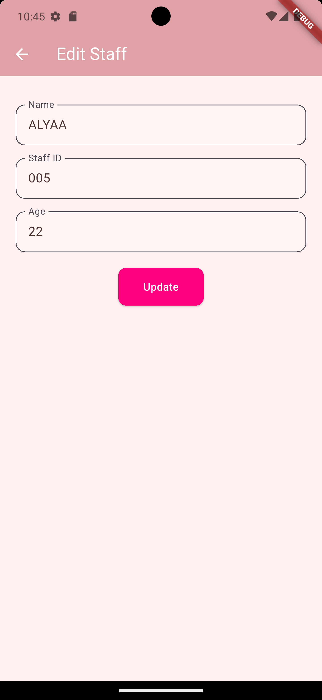

# 📝 Staff Management App (Lab Test Project)

A simple Flutter application that performs basic **CRUD operations** (Create, Read, Update, Delete) using **Firebase Firestore**.

---

## 👤 Developer Info

- **Name:** SYAZANA ALYAA BINTI MOHD RAFI 
- **Matric Number:** D20221101875
- **Subject:** Mobile Application
- **Group:** B
- **Lecturer Name:** Dr. Ahmad Wiraputra bin Selamat

---

## 📸 Apps Design

### ➕ Add Staff Page
  

### 📋 Staff List Page
  

### 📋 Edit List Page
  

---
